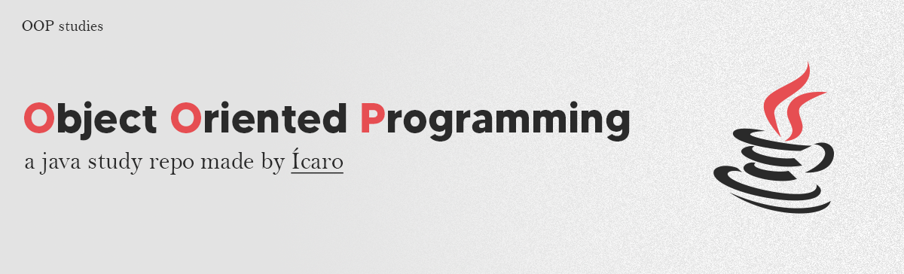

# OOP Studies (with Java)
This repository is dedicated to studying Object-Oriented Programming (OOP) concepts and principles, with a focus on Java. It serves as a personal archive for storing study materials, exercises, and small projects related to OOP.
